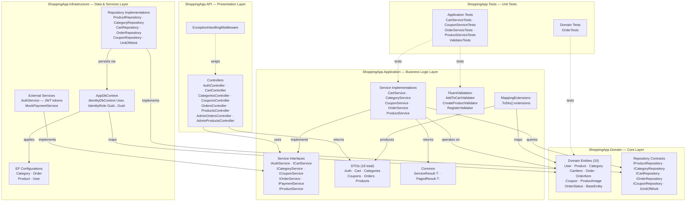
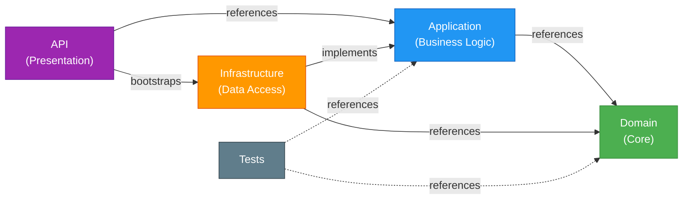
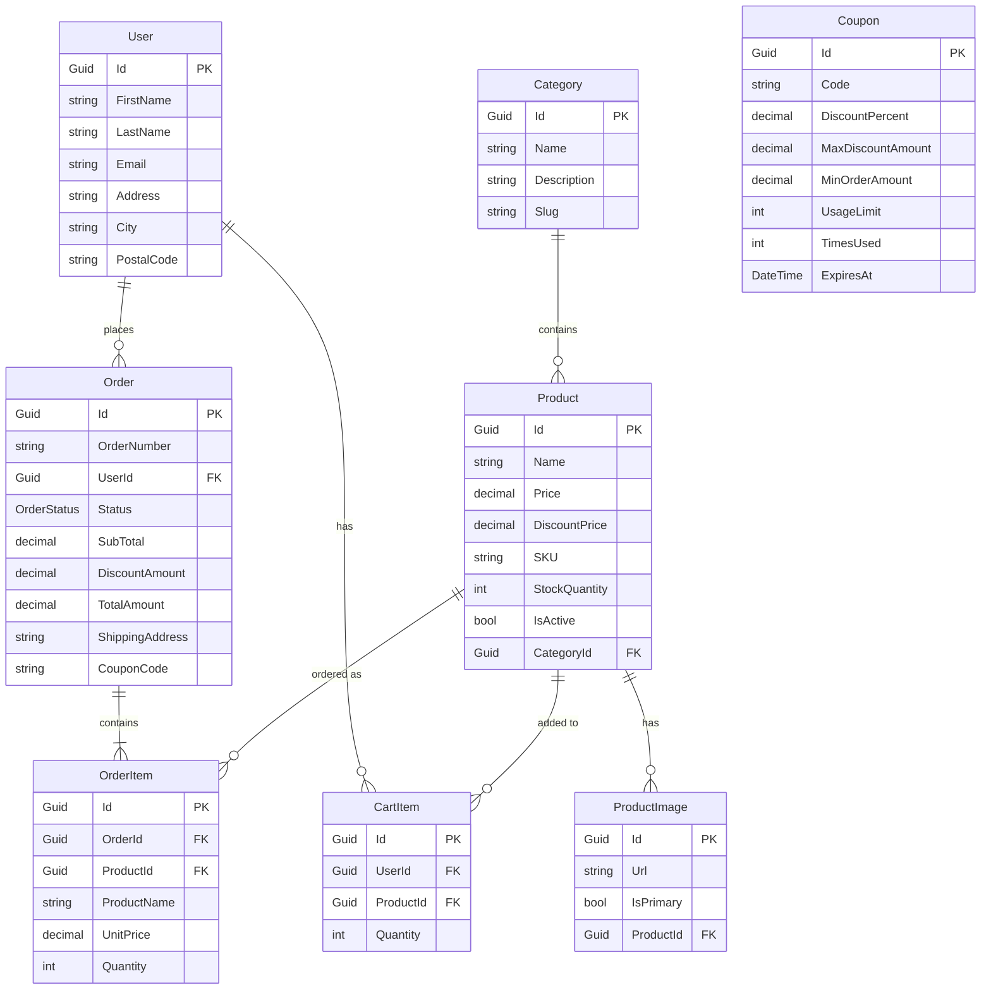

# ShoppingApp — Repository Structure & Architecture

## Architecture Overview

This project follows **Clean (Onion) Architecture** with four distinct layers and strict dependency rules. The Domain layer sits at the center with zero outward dependencies, the Application layer contains business logic and service contracts, the Infrastructure layer handles persistence and external integrations, and the API layer manages HTTP presentation concerns.

## High-Level Architecture Diagram



## Layer Dependency Flow



> **Domain** has zero outward dependencies. **Application** depends only on Domain. **Infrastructure** implements interfaces from both Application and Domain. **API** wires everything together via DI. **Tests** reference Application and Domain only (no Infrastructure or API).

## Entity Relationship Diagram



## Directory Structure

```
coursepractice/
├── README.md
├── QA-REPORT.md
├── STRUCTURE.md
├── src/
│   ├── ShoppingApp.API/                    # Presentation layer (8 controllers)
│   │   ├── Program.cs                      # App bootstrap, DI, JWT, Swagger, role seeding
│   │   ├── appsettings.json                # Configuration
│   │   ├── Controllers/                    # REST API endpoints
│   │   │   ├── AuthController.cs           #   POST /auth/register, /auth/login
│   │   │   ├── CartController.cs           #   GET/POST/PUT/DELETE /cart
│   │   │   ├── CategoriesController.cs     #   GET/POST /categories
│   │   │   ├── CouponsController.cs        #   GET/POST /coupons, validate
│   │   │   ├── OrdersController.cs         #   GET/POST /orders
│   │   │   ├── ProductsController.cs       #   GET /products
│   │   │   ├── AdminOrdersController.cs    #   PUT /admin/orders (status updates)
│   │   │   └── AdminProductsController.cs  #   CRUD /admin/products
│   │   └── Middleware/
│   │       └── ExceptionHandlingMiddleware.cs  # Global error handling
│   │
│   ├── ShoppingApp.Application/            # Business logic layer
│   │   ├── Common/                         # ServiceResult<T>, PagedResult<T>
│   │   ├── DTOs/                           # 18 data transfer objects
│   │   │   ├── Auth/                       #   AuthResponseDto, LoginDto, RegisterDto
│   │   │   ├── Cart/                       #   AddToCartDto, CartItemDto, UpdateCartItemDto
│   │   │   ├── Categories/                 #   CategoryDto, CreateCategoryDto
│   │   │   ├── Coupons/                    #   CouponDto, CreateCouponDto
│   │   │   ├── Orders/                     #   CreateOrderDto, OrderDto, OrderItemDto
│   │   │   └── Products/                   #   CreateProductDto, ProductDto, UpdateProductDto
│   │   ├── Interfaces/                     # 7 service contracts
│   │   ├── Mappings/                       # Entity → DTO via .ToDto() extensions
│   │   ├── Services/                       # 5 business logic implementations
│   │   └── Validators/                     # 3 FluentValidation validators
│   │
│   ├── ShoppingApp.Domain/                 # Core domain layer (zero dependencies)
│   │   ├── Entities/                       # 10 domain models with business rules
│   │   └── Interfaces/                     # 5 repository contracts + IUnitOfWork
│   │
│   └── ShoppingApp.Infrastructure/         # Data access & external services
│       ├── DependencyInjection.cs          # EF Core, Identity, repo registration
│       ├── Data/
│       │   ├── AppDbContext.cs             # IdentityDbContext with 7 DbSets
│       │   └── Configurations/             # 4 Fluent API entity configurations
│       ├── Repositories/                   # 5 repository + UnitOfWork implementations
│       └── Services/
│           ├── AuthService.cs              # JWT token generation & Identity auth
│           └── MockPaymentService.cs       # Mock payment processor
│
└── tests/
    └── ShoppingApp.Tests/                  # Unit tests (Moq + xUnit)
        ├── Application/                    # 5 service & validator test classes
        └── Domain/                         # Entity business logic tests
```

## Key Design Patterns

| Pattern | Implementation |
|---------|---------------|
| **Clean Architecture** | Four layers with strict dependency inversion; Domain at the center |
| **Repository** | `IXxxRepository` interfaces in Domain, EF Core implementations in Infrastructure |
| **Unit of Work** | `IUnitOfWork` aggregates all 5 repositories + `SaveChangesAsync()` for atomic transactions |
| **Result Pattern** | `ServiceResult<T>` with `Ok(data)` / `Fail(error)` for consistent success/failure responses |
| **DTO Mapping** | Manual `.ToDto()` extension methods in `MappingExtensions` — no AutoMapper dependency |
| **Dependency Injection** | Constructor injection; services registered in `Program.cs` + `DependencyInjection.cs` |
| **Middleware Pipeline** | `ExceptionHandlingMiddleware` for centralized exception-to-HTTP-response mapping |
| **FluentValidation** | Auto-registered validators for `AddToCart`, `CreateProduct`, `Register` requests |
| **Role-Based Auth** | JWT Bearer tokens with `Admin` and `Customer` roles seeded on startup |

## Service-to-Repository Mapping

| Service | Interface | Dependencies |
|---------|-----------|-------------|
| `ProductService` | `IProductService` | `IUnitOfWork.Products` |
| `CartService` | `ICartService` | `IUnitOfWork.Cart`, `IUnitOfWork.Products` |
| `CategoryService` | `ICategoryService` | `IUnitOfWork.Categories` |
| `CouponService` | `ICouponService` | `IUnitOfWork.Coupons` |
| `OrderService` | `IOrderService` | `IUnitOfWork` (all repos), `IPaymentService` |
| `AuthService` | `IAuthService` | `UserManager<User>`, `IConfiguration` (JWT settings) |
| `MockPaymentService` | `IPaymentService` | None (returns mock success) |

## Domain Entities — Key Business Logic

| Entity | Business Methods |
|--------|-----------------|
| `Product` | `EffectivePrice` — returns `DiscountPrice ?? Price`; `HasSufficientStock(qty)` — stock check; `ReduceStock(qty)` — decrements inventory |
| `Order` | `GenerateOrderNumber()` — creates unique order numbers; `Cancel()` — transitions status to Cancelled |
| `Coupon` | `IsValid()` — checks expiry, usage limits; `CalculateDiscount(orderTotal)` — applies percentage with max cap and minimum order threshold |
| `OrderItem` | `LineTotal` — computed as `UnitPrice × Quantity` |

## Infrastructure Configuration

| Component | Details |
|-----------|---------|
| **Database** | SQL Server via EF Core (`DefaultConnection` connection string) |
| **Identity** | `IdentityDbContext<User, IdentityRole<Guid>, Guid>` — passwords require 8+ chars, digit, uppercase; unique email enforced |
| **JWT Auth** | Issuer/audience validation, `SymmetricSecurityKey` from `Jwt:Key` config |
| **Swagger** | OpenAPI v1 with Bearer token security scheme |
| **Role Seeding** | `Admin` and `Customer` roles created on startup if absent |

## Tech Stack

- **.NET 8** / ASP.NET Core Web API
- **Entity Framework Core** with SQL Server
- **ASP.NET Core Identity** with Guid-based users and roles
- **JWT Bearer Authentication** with role-based authorization
- **FluentValidation** for request validation
- **Swagger / OpenAPI** for API documentation
- **Moq** + **xUnit** for unit testing
